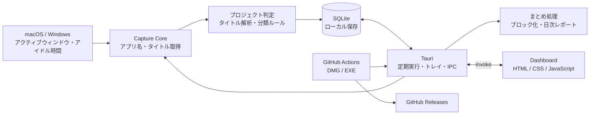
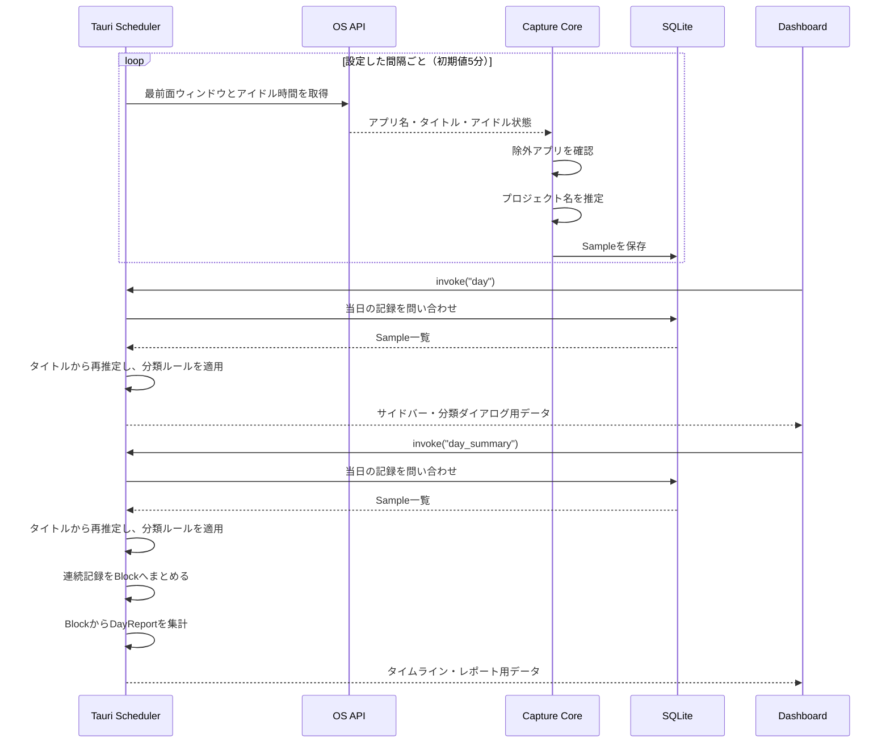
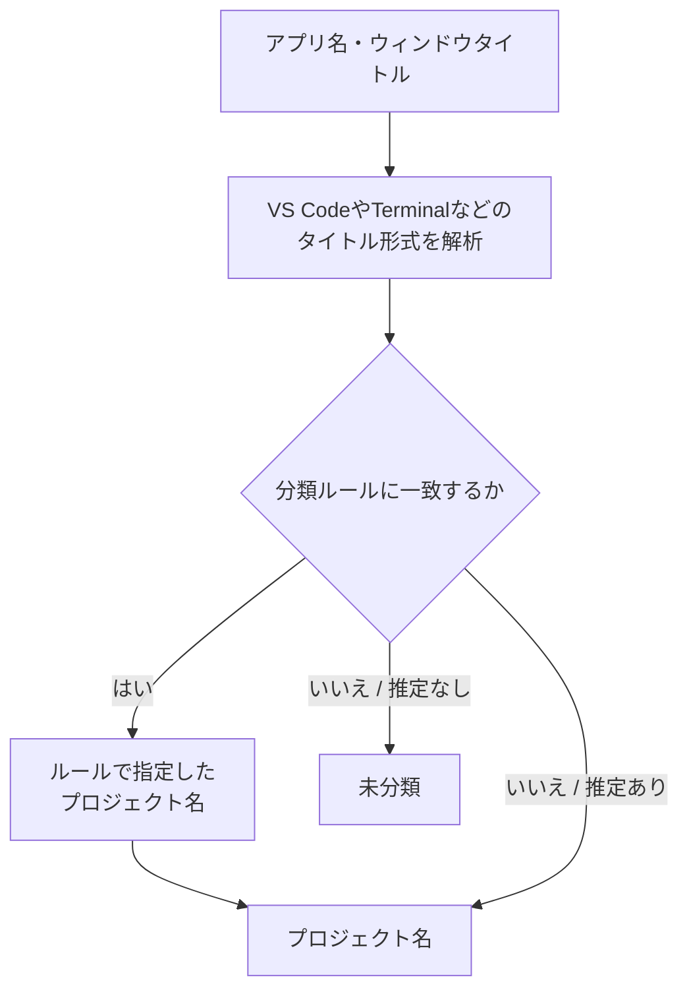
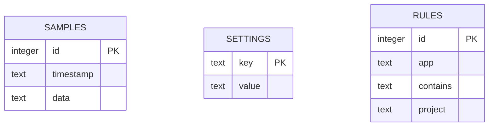
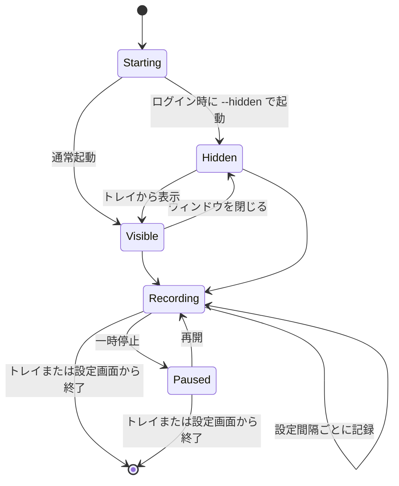
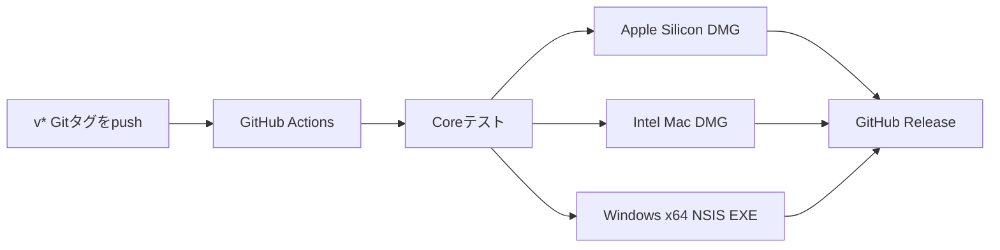

# Worklog アーキテクチャ

Worklogは、サーバーを使わず端末内だけで動作するTauriデスクトップアプリです。Rustが作業情報の取得・分類・保存・定期実行を担当し、HTML/CSS/JavaScriptがダッシュボードと設定画面を担当します。

## 全体構成



## コンポーネント

| レイヤー | 主なファイル | 役割 |
|---|---|---|
| コアの公開API | [`crates/worklog-core/src/lib.rs`](crates/worklog-core/src/lib.rs) | モジュール宣言と公開APIの再公開。利用側は `worklog_core::名前` で参照 |
| データ型・設定 | [`model.rs`](crates/worklog-core/src/model.rs) | Sample・Block・各レポート・Rule・Settings・Resultと設定の検証 |
| プロジェクト推定 | [`project.rs`](crates/worklog-core/src/project.rs) | アプリ種別の判定とタイトル解析 |
| OS情報の取得 | [`capture/mod.rs`](crates/worklog-core/src/capture/mod.rs), [`macos.rs`](crates/worklog-core/src/capture/macos.rs), [`other.rs`](crates/worklog-core/src/capture/other.rs) | ウィンドウ取得、アイドル判定、アクセシビリティ。OS別実装は `platform` として参照 |
| 保存・分類ルール | [`store.rs`](crates/worklog-core/src/store.rs) | SQLite操作、設定と分類ルールの保存、読み出し時の分類 |
| 集計 | [`summary.rs`](crates/worklog-core/src/summary.rs) | 記録間隔の推定、連続記録のブロック化、日次レポート |
| CLI | [`crates/worklog-core/src/main.rs`](crates/worklog-core/src/main.rs) | 1回だけ記録するコマンドライン用エントリーポイント |
| デスクトップアプリ | [`src-tauri/src/main.rs`](src-tauri/src/main.rs) | 定期実行、トレイ、自動起動、二重起動防止、画面との通信 |
| ダッシュボード | [`ui/index.html`](ui/index.html), [`ui/dashboard.js`](ui/dashboard.js) | タイムライン、集計、設定、分類ルールの操作 |
| アプリ設定 | [`src-tauri/tauri.conf.json`](src-tauri/tauri.conf.json) | ウィンドウ、権限、バンドル情報 |
| リリース | [`.github/workflows/release.yml`](.github/workflows/release.yml) | macOS DMGとWindows EXEの自動ビルド・公開 |

テストは対象モジュール内に置き、共通の日時・サンプル生成はテスト専用の [`test_support.rs`](crates/worklog-core/src/test_support.rs) にまとめています。

## 記録データの流れ



1件の作業記録は、概ね次の情報を持ちます。

```text
Sample
├── id
├── timestamp（UTC）
├── interval_minutes（その記録時点の記録間隔）
├── app（アプリ名）
├── title（最前面ウィンドウのタイトル）
├── project（推定したプロジェクト名）
├── source（accessibility / window_title / accessibility_denied / idle。読み出し時に分類ルールが一致すると rule）
└── status（captured / idle / title_unavailable / permission_required）
```

`day_summary` は当日の `Sample` を古い順に読み出し、アプリ名・タイトル・状態が同じ隣接記録を `Block` にまとめます。前回記録の間隔の1.5倍を超えて空いた場合は、スリープや一時停止などの途切れとして別ブロックにします。`DayReport` はブロックをプロジェクト別に集計し、離席ブロックは作業時間とは分けて返します。

ブラウザでは選択中タブのタイトルを取得します。すべてのタブ、ページ本文、URL、キー入力、ChatGPTの会話本文、スクリーンショットは記録しません。

## プロジェクト判定



既知の形式はRust側で解析します。アプリ名は部分一致せず、Code / Visual Studio Code / Cursor / Zed / JetBrains IDE / Xcode / Obsidian / Figma / Terminalなどの対応名から種類を決め、その種類ごとのタイトル形式だけを解析します。例えばVS Code系のワークスペース、ZedやXcodeの先頭プロジェクト、ObsidianのVault名、`worklog:` を含むTerminalタイトルからプロジェクト名を推定します。形式に合わないタイトルや、1要素だけでファイル名・ダイアログ名・ようこそ画面と区別できないタイトルは未分類にします。分類ルールは、アプリ名とタイトルの部分一致でプロジェクト名を補います。

記録の読み出し時には、idle以外のサンプルに対してタイトルからの推定を再実行してから分類ルールを適用します。これによりタイトル解析の修正と新しいルールを過去の記録表示へ反映でき、両方が一致した場合は分類ルールを優先します。

## ローカルデータ

SQLiteには主に3種類のデータを保存します。



- `samples`: 作業記録。追加のたびに、1か月前の日の0時（ローカル時刻）より古い行を削除する
- `settings`: 記録間隔、アイドル判定時間、除外アプリ、一時停止状態など
- `rules`: プロジェクト分類ルール

データベースはOSのアプリデータディレクトリにある`worklog.sqlite3`へ保存されます。外部APIやクラウドストレージには送信しません。

## バックグラウンド動作



ウィンドウを閉じてもプロセスは終了せず、システムトレイで記録を続けます。アプリ自体が終了している間は記録できないため、ログイン時の自動起動で補います。

## フロントエンドとRustの通信

画面はTauriの`invoke`を通してRustコマンドを呼び出します。ローカルHTTPサーバーはありません。

主な操作は次のとおりです。

- `day`: 当日の記録取得
- `day_summary`: 当日のまとまりと日次レポート取得
- `status`: 状態、次回記録時刻、DB保存先の取得
- `set_paused`: 一時停止・再開
- `get_settings` / `save_settings`: 設定の取得・保存
- `get_autostart` / `set_autostart`: 自動起動の取得・変更
- `accessibility_status` / `request_accessibility_permission`: アクセシビリティ権限の確認・要求
- `rules` / `add_rule` / `delete_rule`: 分類ルールの取得・追加・削除
- `quit_app`: アプリ終了

ダッシュボード側では、`day_summary` のブロックを新しい順にタイムライン表示し、レポート画面では同じ日付の推定時間をプロジェクト単位に表示します。`day` の記録単位データは、サイドバーのプロジェクト一覧、分類ダイアログの一致件数、分類解除ダイアログの件数に使います。

## ビルドと配布

ルート [`Cargo.toml`](Cargo.toml) は仮想workspaceです。`crates/worklog-core` と `src-tauri` がルートの `Cargo.lock`・`target/` を共有し、versionとeditionを `workspace.package` から継承します。TauriもCargoのバージョンを使い、リリース時はその値とタグ `v{version}` の一致を確認します。`default-members` はコアのみです。検証コマンドは[READMEの開発・検証](README.md#開発検証)を参照してください。ローカルのインストーラー出力先は `target/release/bundle/`、CIで `--target` を指定した場合は `target/<target>/release/bundle/` です。



GitHub ActionsがmacOSとWindowsの環境でネイティブビルドを行い、3種類のインストーラーをGitHub Releasesへ公開します。

現在のmacOS版は公証なし、Windows版はコード署名なしのため、初回起動時にOSの確認画面が表示される場合があります。

## 現在の設計上の特徴

- データは端末内だけに保存される
- UIを閉じてもトレイ常駐で記録を続けられる
- 記録コアをTauriの画面から分離している
- 分類ルールを過去の記録表示にも反映できる
- 低頻度の個人用記録に合わせ、SQLiteと単一プロセスで構成している

将来、ブラウザ拡張やIDEプラグインを追加すれば、タイトルだけでは判別できないリポジトリ、URL、タブの種類などを明示的に受け取れる構成へ拡張できます。
