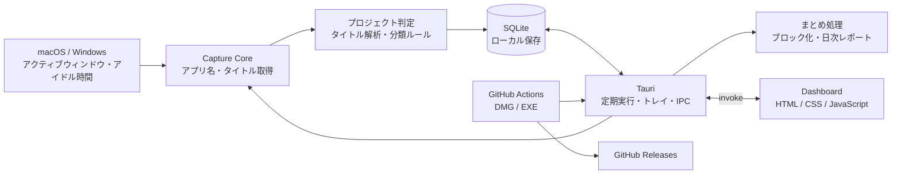
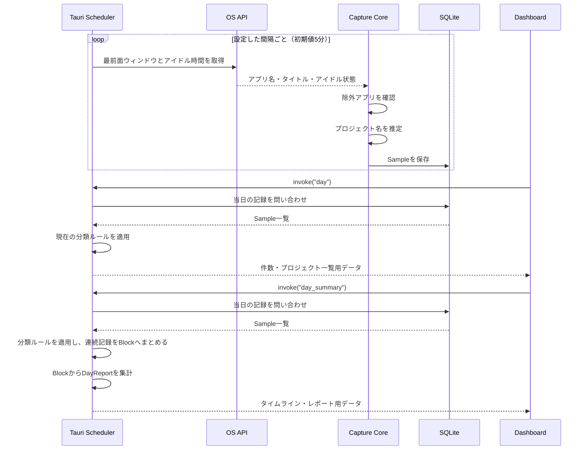
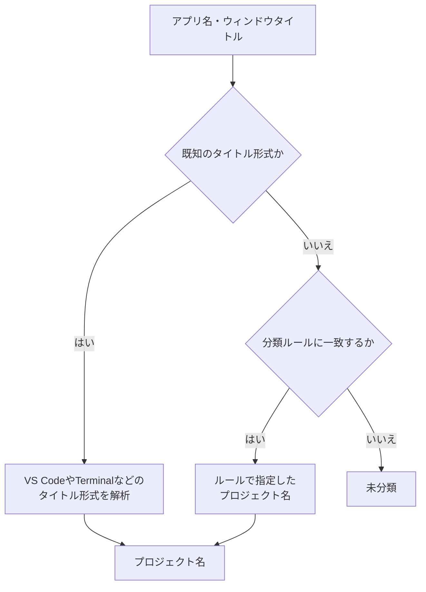
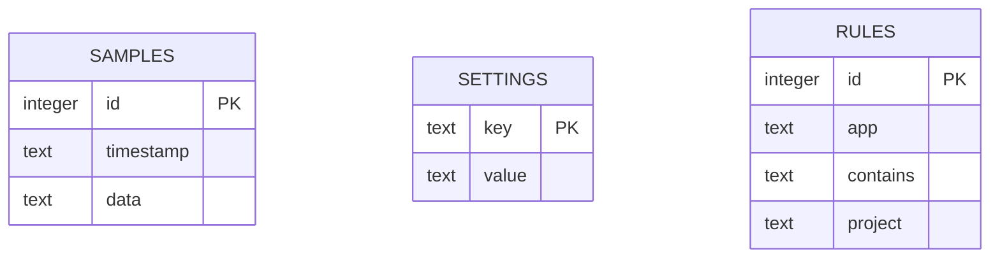
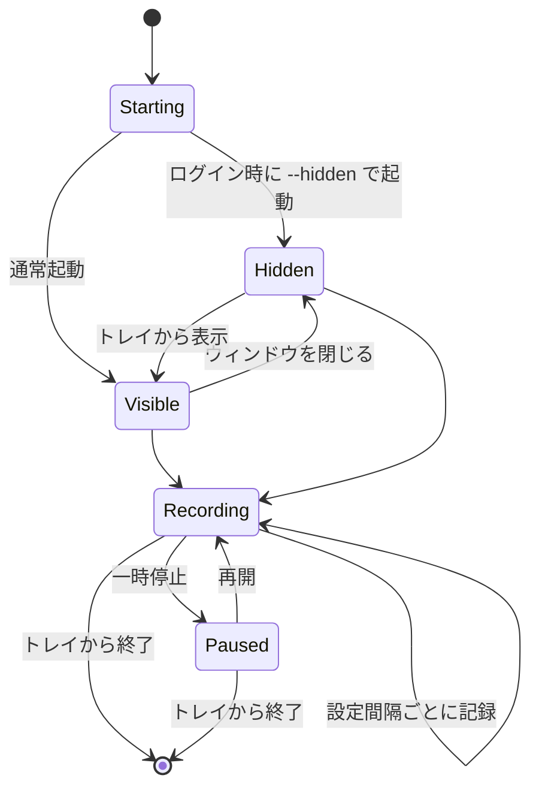
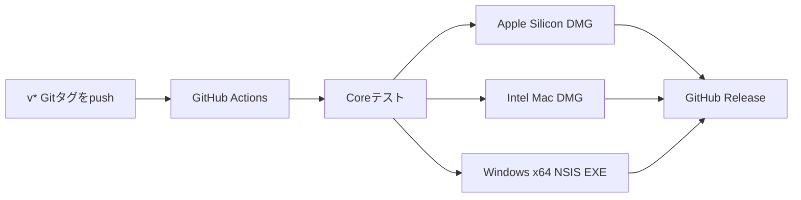

# Worklog アーキテクチャ

Worklogは、サーバーを使わず端末内だけで動作するTauriデスクトップアプリです。Rustが作業情報の取得・分類・保存・定期実行を担当し、HTML/CSS/JavaScriptがダッシュボードと設定画面を担当します。

## 全体構成



## コンポーネント

| レイヤー | 主なファイル | 役割 |
|---|---|---|
| 記録・分類コア | [`src/lib.rs`](src/lib.rs) | OS情報の取得、アイドル判定、プロジェクト推定、SQLite操作 |
| CLI | [`src/main.rs`](src/main.rs) | 1回だけ記録するコマンドライン用エントリーポイント |
| デスクトップアプリ | [`src-tauri/src/main.rs`](src-tauri/src/main.rs) | 定期実行、トレイ、自動起動、二重起動防止、画面との通信 |
| ダッシュボード | [`ui/index.html`](ui/index.html), [`ui/dashboard.js`](ui/dashboard.js) | タイムライン、集計、設定、分類ルールの操作 |
| アプリ設定 | [`src-tauri/tauri.conf.json`](src-tauri/tauri.conf.json) | ウィンドウ、権限、バンドル情報 |
| リリース | [`.github/workflows/release.yml`](.github/workflows/release.yml) | macOS DMGとWindows EXEの自動ビルド・公開 |

## 記録データの流れ



1件の作業記録は、概ね次の情報を持ちます。

```text
Sample
├── id
├── timestamp（UTC）
├── interval_minutes（その記録時点の記録間隔）
├── app（アプリ名）
├── title（最前面ウィンドウのタイトル）
├── project（推定したプロジェクト名）
├── source（情報の取得元）
└── status（active / idle）
```

`day_summary` は当日の `Sample` を古い順に読み出し、アプリ名・タイトル・状態が同じ隣接記録を `Block` にまとめます。前回記録の間隔の1.5倍を超えて空いた場合は、スリープや一時停止などの途切れとして別ブロックにします。`DayReport` はブロックをプロジェクト別に集計し、離席ブロックは作業時間とは分けて返します。

ブラウザでは選択中タブのタイトルを取得します。すべてのタブ、ページ本文、URL、キー入力、ChatGPTの会話本文、スクリーンショットは記録しません。

## プロジェクト判定



既知の形式はRust側で解析します。例えば、VS Code/CursorのウィンドウタイトルやTerminalのパス表現からプロジェクト名を推定します。それ以外は、アプリ名とタイトルの部分一致を使う分類ルールで補えます。

分類ルールは記録の読み出し時にも適用されるため、新しいルールを過去の記録表示へ反映できます。

## ローカルデータ

SQLiteには主に3種類のデータを保存します。



- `samples`: 作業記録
- `settings`: 記録間隔、アイドル判定時間、除外アプリ、一時停止状態など
- `rules`: プロジェクト分類ルール

データベースはOSのアプリデータディレクトリにある`worklog.sqlite3`へ保存されます。外部APIやクラウドストレージには送信しません。

## バックグラウンド動作



ウィンドウを閉じてもプロセスは終了せず、システムトレイで記録を続けます。アプリ自体が終了している間は記録できないため、ログイン時の自動起動で補います。

## フロントエンドとRustの通信

画面はTauriの`invoke`を通してRustコマンドを呼び出します。ローカルHTTPサーバーはありません。

主な操作は次のとおりです。

- 当日の記録取得
- 当日のまとまりと日次レポート取得
- 状態と次回記録時刻の取得
- 一時停止・再開
- 設定の取得・保存
- 自動起動の変更
- 分類ルールの追加・削除
- アプリ終了

ダッシュボード側では、`day_summary` のブロックを新しい順にタイムライン表示し、レポート画面では同じ日付の推定時間をプロジェクト単位に表示します。件数やサイドバーのプロジェクト一覧には、引き続き `day` の記録単位データを使います。

## ビルドと配布



GitHub ActionsがmacOSとWindowsの環境でネイティブビルドを行い、3種類のインストーラーをGitHub Releasesへ公開します。

現在のmacOS版は公証なし、Windows版はコード署名なしのため、初回起動時にOSの確認画面が表示される場合があります。

## 現在の設計上の特徴

- データは端末内だけに保存される
- UIを閉じてもトレイ常駐で記録を続けられる
- 記録コアをTauriの画面から分離している
- 分類ルールを過去の記録表示にも反映できる
- 低頻度の個人用記録に合わせ、SQLiteと単一プロセスで構成している

将来、ブラウザ拡張やIDEプラグインを追加すれば、タイトルだけでは判別できないリポジトリ、URL、タブの種類などを明示的に受け取れる構成へ拡張できます。
